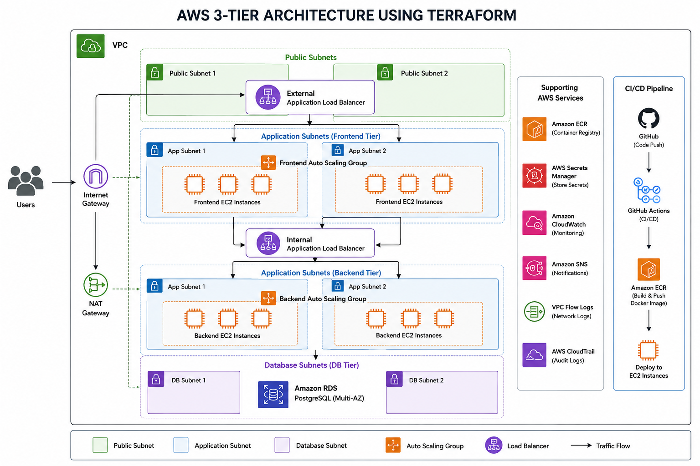
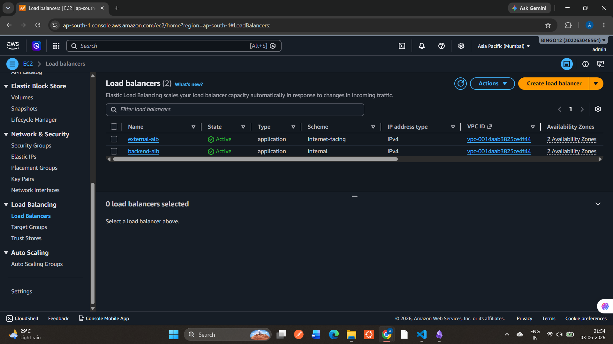
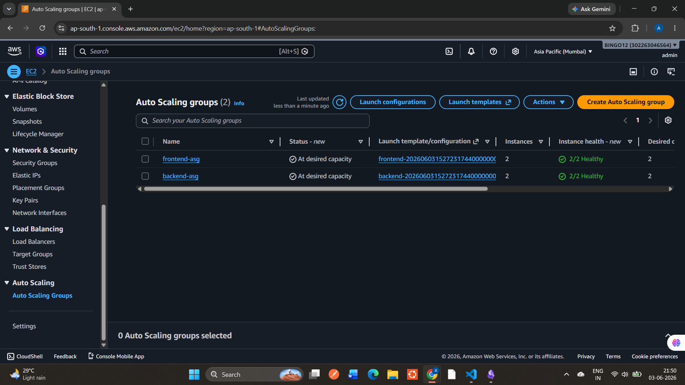
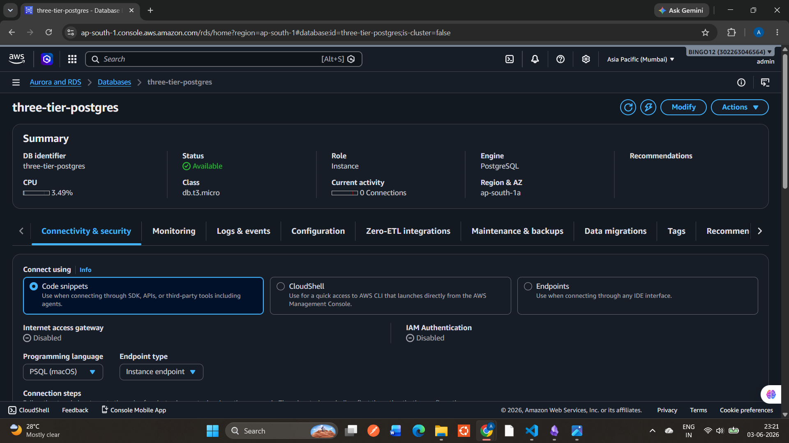
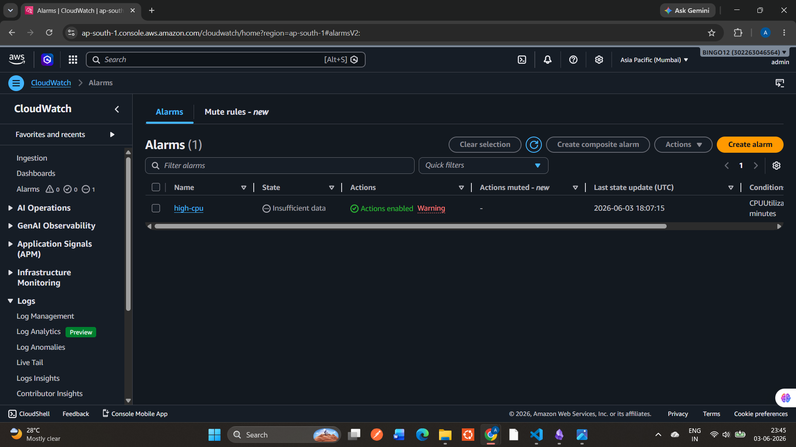
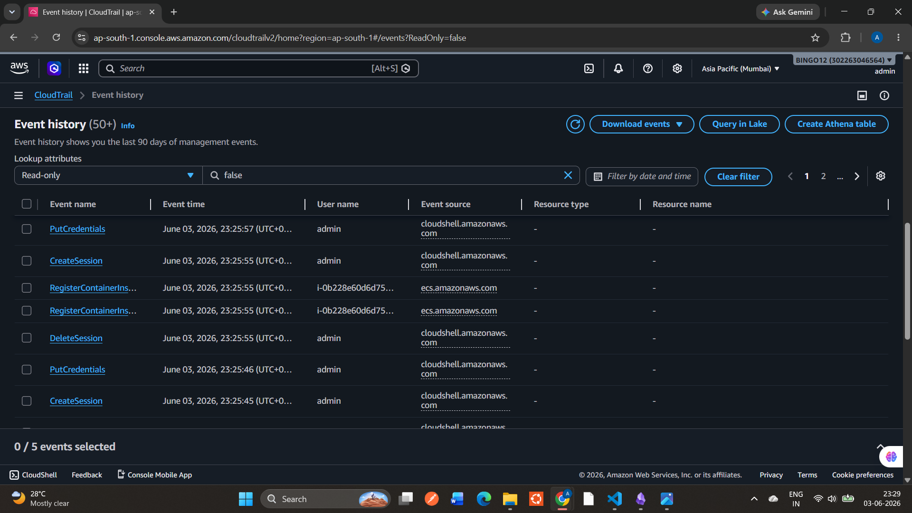
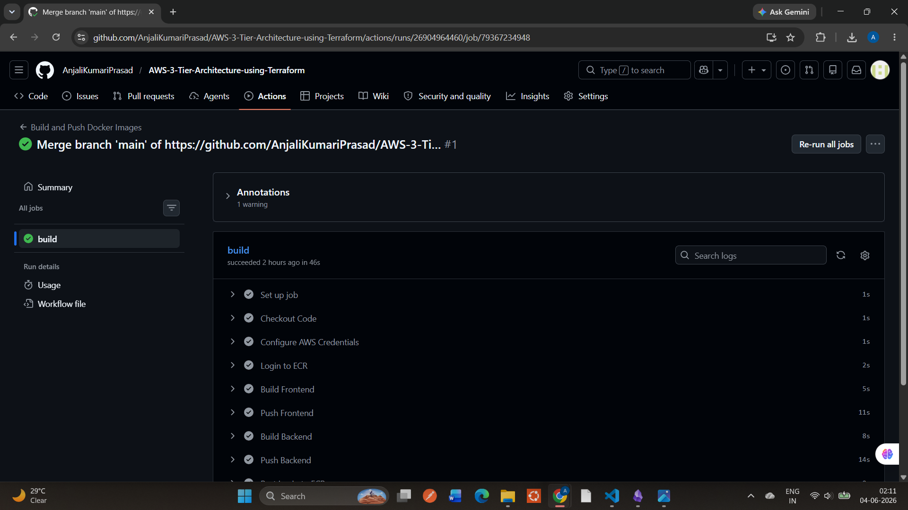

# AWS 3-Tier Architecture using Terraform

## Overview

This project demonstrates deployment of a scalable 3-tier architecture on AWS using Terraform. The infrastructure follows Infrastructure as Code (IaC) principles and incorporates networking, security, monitoring, logging, and CI/CD automation.

## Architecture

```text
Users
   │
   ▼
External Application Load Balancer
   │
   ▼
Frontend Auto Scaling Group
   │
   ▼
Frontend EC2 Instances
   │
   ▼
Internal Application Load Balancer
   │
   ▼
Backend Auto Scaling Group
   │
   ▼
Backend EC2 Instances
   │
   ▼
Amazon RDS PostgreSQL
```

### Supporting Services

* Amazon ECR
* AWS Secrets Manager
* Amazon CloudWatch
* Amazon SNS
* AWS CloudTrail
* VPC Flow Logs
* GitHub Actions CI/CD

## Architecture Diagram





## Screenshots


### Application Load Balancer





### Auto Scaling Groups





### Amazon RDS





### Amazon ECR


### CloudWatch Monitoring





### CloudTrail




### GitHub Actions CI/CD





## AWS Services Used

* Amazon VPC
* EC2
* Auto Scaling Groups
* Launch Templates
* Application Load Balancer
* Amazon RDS PostgreSQL
* Amazon ECR
* IAM
* AWS Secrets Manager
* Amazon CloudWatch
* Amazon SNS
* AWS CloudTrail
* VPC Flow Logs

## CI/CD Pipeline

GitHub Actions automates:

1. Source code checkout
2. Docker image build
3. Image push to Amazon ECR
4. Deployment workflow execution

## Security Features

* Private application and database subnets
* Security Groups with least-privilege access
* IAM Roles and Instance Profiles
* Secrets stored in AWS Secrets Manager
* Audit logging through CloudTrail
* Network monitoring through VPC Flow Logs

## Cost Optimization Decisions

* Route 53 can be integrated for custom domain management. For cost optimization during development, this project uses the Application Load Balancer DNS endpoint.
* The architecture is designed to support Multi-AZ deployments. During development and testing, infrastructure was configured with cost optimization in mind while preserving the overall production-ready design.

## Interview Discussion Points

Key topics demonstrated through this project:

* Infrastructure as Code with Terraform
* AWS Networking and Security
* High Availability Architecture
* Auto Scaling and Load Balancing
* Monitoring and Observability
* Containerization with Docker
* CI/CD Automation using GitHub Actions
* Secrets Management and IAM Best Practices

## Future Enhancements

* Route 53 integration for custom domains
* HTTPS with ACM certificates
* Kubernetes (EKS) deployment
* Blue-Green Deployment Strategy
* Centralized Logging and Dashboards

## Author

Anjali Prasad

Cloud & DevOps Enthusiast
